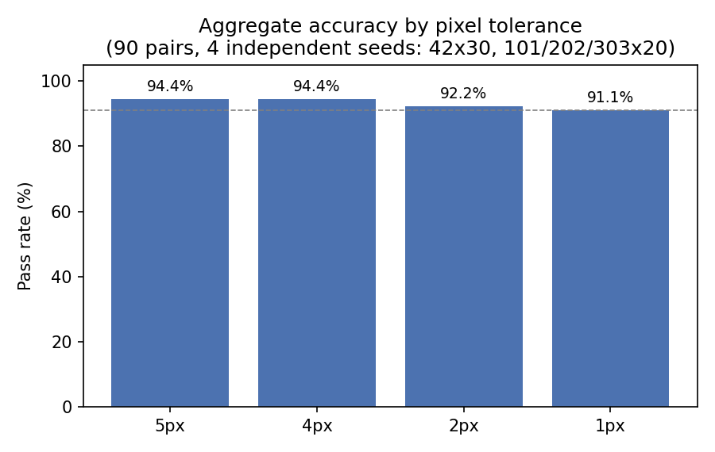
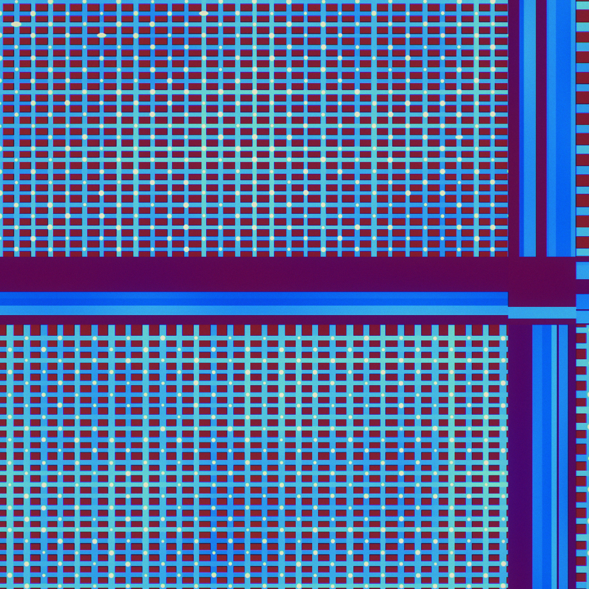
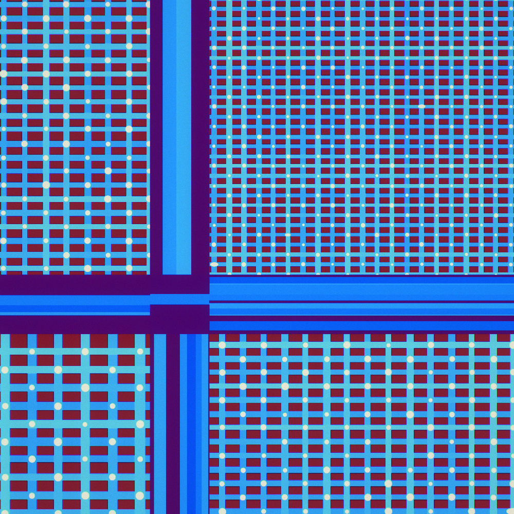
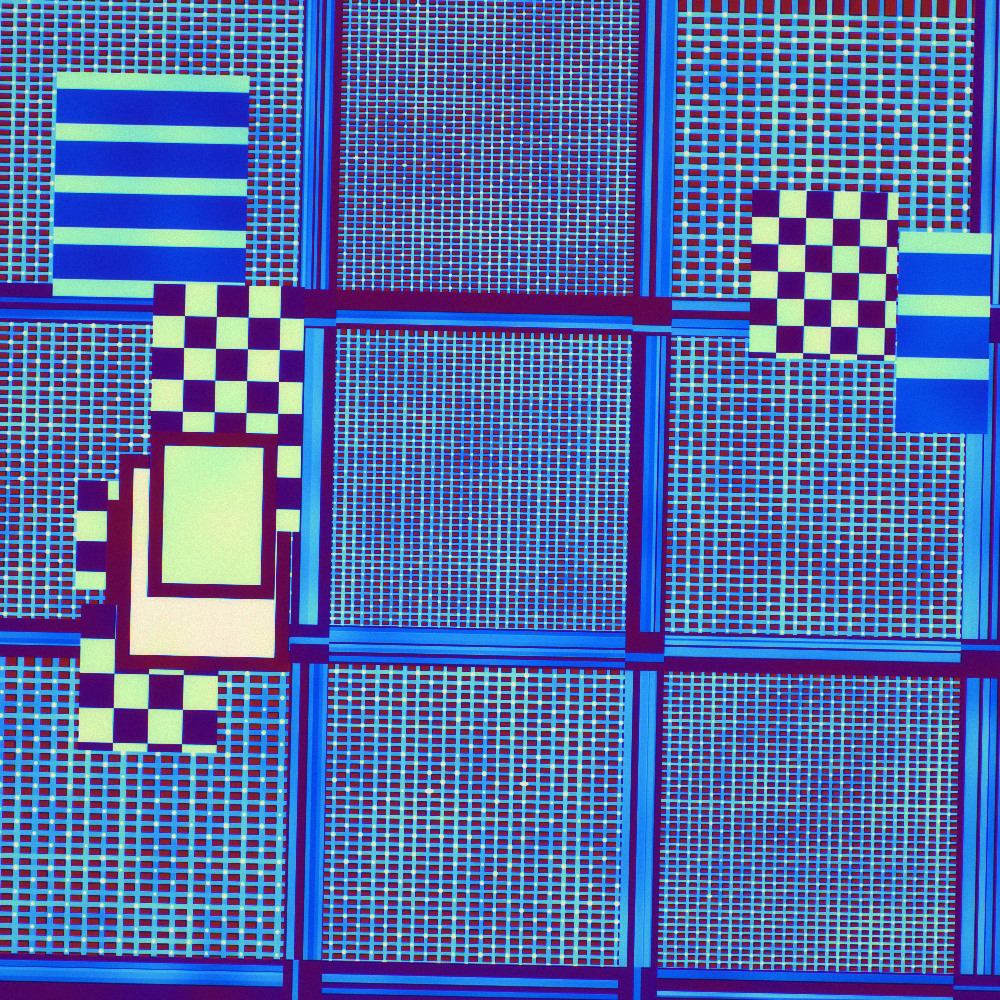
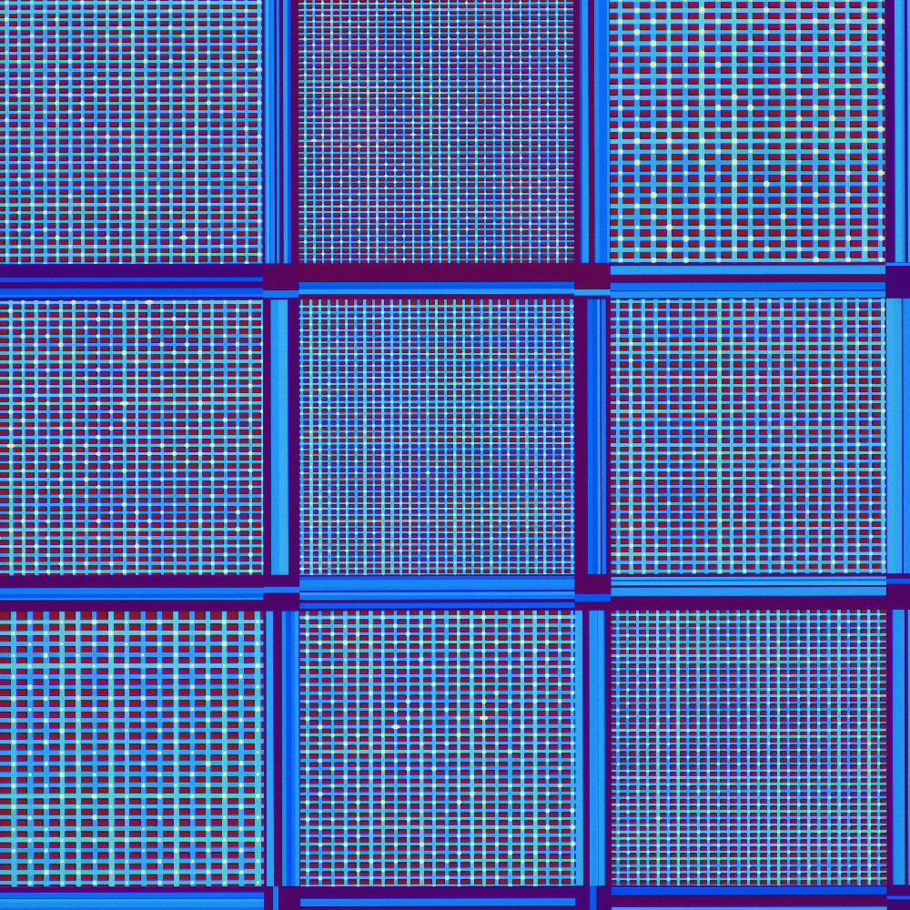
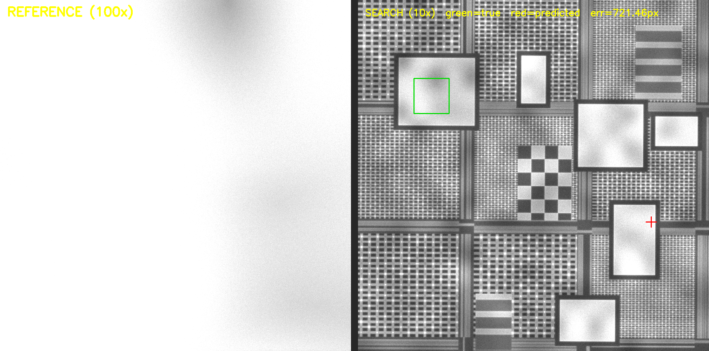

# Drift-Sense — AI-Powered Navigation-Error Recovery for Wafer Inspection Tools

SEMICON India Hackathon 2026 · Track 2 (Applied Materials) submission.

**Team Maverick** · Mandeep Singh Rawat, Vinay

Given a **Reference image** (a small site captured at 100x magnification) and a
**Search image** (a 1000x1000 view of the same die region captured at 10x), this
pipeline locates where the reference pattern appears inside the search image and
returns its center coordinates `(x, y)` in search-image pixels — the core of
Navigation-Error Recovery, solved for highly periodic DRAM and FinFET layouts
where classical single-peak template matching breaks down.

**Results.** The problem statement requires validation on **at least 30**
varied, independently generated pairs. This submission validates on **120
baseline pairs across four independent seeds (30 pairs each)**, plus **60
additional pairs** in targeted robustness sweeps (scale ratio 9:1 and 11:1,
rotation edge 2°) — **180 evaluated pairs total**, each seed/sweep backed by
its own committed `results.csv` (`dataset/`, `sweep101/`, `sweep202/`,
`sweep303/`, `ratio9/`, `ratio11/`, `rot2/`) and reproducible with the exact
seed and command in this README. Seed 42 additionally has every one of its 30
pairs committed as raw, unannotated reference/search images in
`results/dataset_sample/` — every number reported for seed 42 is directly
image-verifiable, not just CSV-verifiable; the other three baseline seeds and
three robustness sweeps are CSV-verifiable but do not carry committed raw
images. A few further robustness checks (dose reduction, boundary bias,
fingerprint ablation) are reported below but were run before this repo
started committing per-run CSVs, so their numbers are prose-only, not
independently file-backed the same way. Reported over **four independent
seeds, 120 pairs total** (mixed DRAM + FinFET, process-variation amplitude
randomized per pair), measured with `evaluate.py` in the exact environment
pinned in `requirements-freeze.txt`. A single run varies noticeably by seed,
so we report the aggregate rather than the best run — and these exact
numbers are tied to that exact environment; see the note at the end of this
section.

| Threshold | Pass rate |
|---|---|
| ≤ 5 px | **93.33 % (112/120)** |
| ≤ 4 px | 93.33 % (112/120) |
| ≤ 2 px | 90.83 % (109/120) |
| ≤ 1 px (sub-pixel) | 90.00 % (108/120) |

| Error statistic (px) | Value |
|---|---|
| Median | **0.09** |
| Mean | 16.12 |
| Worst-case | 721.21 |
| Best-case | 0.01 |
| Mean inference time per pair | **~2.3 s** (CPU only, no GPU) |
| At 2x dose reduction (seed 77) | **100 % (20/20)**, median 0.08 px |
| At 3x dose reduction (seed 555) | **100 % (20/20)**, median 0.12 px |
| Bonus: optical microscope, 3-channel RGB | **100 % (8/8)**, median 0.55 px |

Seeds: `42`, `101`, `202`, `303` (30 pairs each). Per-seed: 30/30, 28/30,
28/30, 26/30. Exact commands in
[Reproducing our reported numbers](#reproducing-our-reported-numbers).



**Read the mean and the median together, not either alone.** The median (0.09 px)
is what a typical pair looks like: sub-pixel, every time, on both structures. The
mean (16.12 px) is dragged up by eight catastrophic misses out of 120 — full lattice
jumps, not near-tolerance overshoots. The worst of them, 721 px, lands the
prediction on essentially a different part of the die entirely. We report both
because a mean-only number would hide how good the typical case is, and a
median-only number would hide that failures, when they happen, are not small.

**These exact figures are pinned to `requirements-freeze.txt`.** Re-measuring
this dataset after an OpenCV/NumPy version change previously shifted the
5 px accuracy by one pair with the *identical* seeds and code — floating-point
differences in blur/resize/warp implementations across library versions are
enough to flip a borderline classification. This is exactly why the
pip-freeze file exists: don't expect to reproduce these numbers on a different
environment than the one it records.

**Three independent cues, by design.** Beyond the periodic array the die carries
(a) discrete sub-array **mats** separated by periphery **strips**, (b) micron-scale
**metrology and assembly structures** — overlay marks, landing pads, CMP
dummy-fill fields, coarse logic blocks — and (c) a smooth across-die
**process-variation fingerprint**. The micron structures are non-periodic
landmarks, so they break lattice ambiguity outright; they are also the only
features above the ~180 nm diffraction limit of a light microscope, which is what
makes the optical bonus modality tractable at all. Disabling the fingerprint
entirely (`--pv-amplitude 0.0`) still leaves 19/20 — the landmarks carry it alone.

**Earlier, weaker die models.** The first version of this generator drew one
uniform array across the whole die; there, removing the fingerprint collapsed
accuracy to 40 %, which is what motivated the mat/strip hierarchy (which took the
same ablation to 90 %) and then the micron-scale structures (95 %). We report the
progression because it shows what each layer of die realism is actually worth.

**What actually limits accuracy.** The eight failures across the 120 baseline
pairs are concentrated on near-uniform, low-process-variation FinFET dies, and
on dies where the fingerprint field itself happens to be weak. A
`--visual-clarity` flag exists for generating the cleanest possible images (for
slides or a quick look) by disabling both disambiguating cues; it costs real
accuracy (measured at 81.67 %, 98/120 -- same four seeds and pair counts as the
headline number, see the comparison table below) and is **off by default** for
exactly that reason — the number quoted above is the one to report.

---

## Bonus modality: optical microscope (RGB)

The same pipeline runs unmodified on 3-channel brightfield optical captures —
`--modality optical` on the generator, no flag at all on the localiser, which
detects the channel count and adapts. 8/8 within 5 px, median error 0.55 px.

### Default build vs. `--visual-clarity` build

| Default build (both cues on) | `--visual-clarity` build (cues off) |
|---|---|
|  |  |
|  |  |
| **93.33 %** (112/120) | **81.67 %** (98/120) |

Both columns are now on the same basis: the same four seeds (`42`, `101`,
`202`, `303`) and the same 30 pairs/seed as the headline number above, so this
is a genuine apples-to-apples comparison of what the ablation costs — not the
predates-the-expansion 71.2 % (57/80) figure reported in earlier versions of
this README, which was measured on a smaller, 20-pairs/seed basis. Per-seed
pass rate for the `--visual-clarity` build: 21/30, 25/30, 27/30, 25/30.

Left column: mats carry the process-variation fingerprint (soft cloudy shading)
and micron-scale landmarks (checkerboards, pads, stripes). Right column: both
cues switched off, so the mats are flat and clean.

This is an ablation, not decoration. The right-hand images look tidier — and
cost real accuracy: 11.66 points, from 93.33 % to 81.67 %. What reads to the
eye as clutter is exactly what lets the localiser disambiguate one lattice
period from another. The clean build is for slides only; **do not quote its
number as the pipeline's accuracy.** (Unlike the default-build headline
number, this figure was not measured in the exact environment pinned in
`requirements-freeze.txt` — see the note in Results on how a library-version
difference can shift a point or two — and has not been independently
re-verified cross-platform the way the default-build number was in
[Held-out generalization check](#held-out-generalization-check) above; treat
it as accurate but slightly less scrutinized than the headline figure.)

Colour is real 3-channel capture, not a colour map applied to a grey image — see
the `applyColorMap` regression test in [Tests](#tests). Verify for yourself:

```bash
python -c "import cv2, numpy as np; im = cv2.imread('results/rgb/default_search.png'); print(im.shape); print('grey' if np.allclose(im[:,:,0], im[:,:,1]) else 'RGB ok')"
```

### What is physically different in the optical case

Both differences are modelled rather than faked:

- **The 10x reference/search pair does not survive.** Optical resolution is about
  `lambda / (2 NA)`. Our first attempt used a dry objective (NA 0.90), giving
  roughly 305 nm at 550 nm — a 1 um reference field then contains barely three
  resolution elements and no matchable structure at all, and it produced a
  literally featureless green square. The optical reference field is therefore a
  third of the search field (~3.3 um), the smallest field that still contains
  mat/strip structure once the 36–96 nm array has been washed out by diffraction.
  The fine array is invisible in optical mode, as it must be.
- **Colour is interference, not decoration.** Reflectance per channel follows
  `cos(4*pi*n*t/lambda_c)` for dielectric thickness `t`, so across-die thickness
  non-uniformity appears as a *hue* shift. The fingerprint is therefore carried
  partly in chroma, which is why the localiser correlates all three channels
  jointly instead of converting to luminance first. Lateral chromatic
  aberration, per-channel diffraction radius, Bayer demosaic correlation and a
  white-balance error are modelled too.

The reported optical results use an oil-immersion objective (NA 1.40) under
short-wave illumination, giving the ~180 nm resolution quoted throughout this
README. The Airy disc is approximated by a Gaussian with sigma ~ 0.21 lambda /
NA; using the Rayleigh radius directly as a sigma over-blurs by about 1.5x, which
is worth stating because it visibly changes the images and cost a factor of two
in median error before we caught it.

Median error is several times worse than SEM (0.55 px vs ~0.1 px): with no
resolvable fine array there are far fewer sharp edges to pin the correlation peak
to, so sub-pixel refinement has less to work with. Accuracy is nonetheless as
high as the SEM case, because the mat/strip/landmark layout is coarse enough that
period-jump ambiguity largely disappears — mats are individually distinguishable
by their interference colour and by the metrology marks they carry. Note that
this is 8 pairs, not 120; treat it as a demonstration that the modality works, not
as a precision accuracy estimate.

---

**A generator bug we found and fixed.** Reference sites were originally drawn
with a border margin computed *before* the affine degradation was applied. A
rotation of up to 1.5° plus 3 % scale about the die centre displaces a corner
site by up to ~320 layout px, which could push the true centre to within half a
template width of the search-image border — where template matching cannot place
the window at all, making the pair unsolvable by construction rather than
genuinely hard. This affected roughly 1 pair in 30. The margin now bounds that
displacement, and all numbers above are measured after the fix.

No deep learning, no model weights, no training step — a fully classical,
CPU-only pipeline that is deterministic and reproducible.

---

## Quick start

Requires Python 3.8 or newer.

```bash
git clone https://github.com/Mandy434/drift-sense
cd drift-sense
pip install -r requirements.txt
```

`requirements.txt` is the complete `pip freeze` of the exact environment every
number in this README was measured in, for exact reproduction. `requirements-freeze.txt`
is kept as an identical, explicitly-named copy of the same freeze.

### 1. Generate a dataset (with ground truth)

```bash
python generate_dataset.py --num-pairs 30 --out results/dataset --style mixed --seed 2026
```

This writes, into `dataset/`:

- `pairNNN_reference.png` — reference image (100x capture)
- `pairNNN_search.png` — search image (10x capture, 1000x1000)
- `ground_truth.json` / `ground_truth.csv` — true center `(x, y)` of the
  reference inside each search image, plus every per-pair generation parameter:
  style, modality, scale ratio, rotation/scale jitter, process-variation
  amplitude, mat-boundary flag, and the actual noise values drawn for that pair
  (dose, blur sigma, read sigma, edge gain for SEM; exposure, read sigma,
  defocus for optical) — not just the ranges they were drawn from.

Options:

| Flag | Default | Meaning |
|---|---|---|
| `--num-pairs N` | 30 | number of image pairs to generate |
| `--out DIR` | `dataset` | output directory |
| `--style {dram,finfet,mixed}` | `dram` | die architecture (`mixed` alternates) |
| `--seed N` | random | RNG seed for reproducibility |
| `--modality {sem,optical}` | `sem` | imaging model; `optical` writes 3-channel RGB (bonus) |
| `--noise-scale F` | 1.0 | `>1` produces noisier images (robustness testing) |
| `--scale-ratio F` | 10.0 | reference:search magnification ratio (spec: nominal 10, robustness testing may probe ~9-11) |
| `--max-rotation-deg F` | 1.5 | search-scene rotation drawn uniformly from [-F, +F] degrees (spec: 1-2 deg may occur) |
| `--pv-amplitude F` | randomized | fix across-die process-variation strength (`0.0` = purely periodic, hardest case) |
| `--boundary-bias F` | 0.35 | fraction of reference sites forced to straddle a mat/strip edge |
| `--visual-clarity` | off | disable the fingerprint and micron landmarks for cleaner-looking images (costs accuracy — slides only) |
| `--search-size N` | 1000 | search image dimension in pixels |
| `--ref-size N` | 1000 | reference image dimension in pixels (spec: 1000x1000, same as search) |

### 2. Run localization on a single pair

```bash
python localize.py --reference results/dataset/pair000_reference.png --search results/dataset/pair000_search.png
```

Prints a single line to stdout — the predicted center:

```
348.43 164.79
```

**Coordinate convention.** Output is `x y` in search-image pixel coordinates,
origin `(0, 0)` at the top-left corner, `x` increasing to the right and `y`
increasing downward — the standard OpenCV/NumPy image-array convention, and
the same one used throughout `ground_truth.csv`/`.json` and `results.csv`.

Add `--verbose` to also print the winning scale/rotation, candidate count and
runtime to stderr (stdout stays a clean `x y` for machine parsing). Add
`--scale-ratio R` to force the assumed magnification ratio instead of having it
read from the image's channel count (10.0 for SEM, 3.0 for optical) — useful if
you generate a pair at a non-default `--search-size`/`--ref-size` combination.

**Confidence.** The spec asks for "a repeatable score or confidence where
possible." Add `--with-confidence` to append a third number — the winning
site's normalized cross-correlation score (roughly `[-1, 1]`, repeatable for a
given input pair):

```bash
python localize.py --reference results/dataset/pair000_reference.png --search results/dataset/pair000_search.png --with-confidence
# 348.43 164.79 0.8215
```

This is opt-in and off by default: `evaluate.py`, `app.py` and the CLI
contract test all parse exactly two numbers from the default invocation, so
the flag adds a number rather than changing what is already there.

### 3. Score the whole dataset

```bash
python src/evaluate.py results/dataset
```

Prints per-pair predicted vs. true center and error in pixels, then a summary:
pass rate at 5/4/2/1 px thresholds, mean/median/worst-case error, runtime with
hardware and Python version and the timing method used. It also writes
`dataset/results.csv` (per-pair prediction, ground truth, error, timing and
generation metadata — reference path, search path, true and predicted x/y) and
`dataset/results.png` (an accuracy-by-threshold chart). Use `--thresholds`,
`--csv`, `--plot`, or `--no-plot` to change any of that.

### 4. Browse it in a browser (optional)

```bash
python src/app.py
```

A Gradio app: pick an architecture, seed and pair count, generate SEM and
optical pairs, and see the localiser's prediction overlaid against ground truth
with the measured error in pixels per pair. Green box is ground truth, red cross
is the prediction, and the arrow between them is the error — if the prediction is
right the arrow is invisibly short, which is the honest outcome.

---

## Repository contents

Layout follows the challenge's recommended `submission/` structure: the two
required entry points, `generate_dataset.py` and `localize.py`, sit at the repo
root exactly as the recommended tree lists them; everything else that supports
them lives under `src/`, committed datasets/plots/examples under `results/`,
citations under `references/`, and empty-but-explained `configs/` and `model/`
stubs (see below — this pipeline has no separate config file or trained
weights, so those folders each hold a short `README.md` saying so rather than
being silently absent).

| Path | Purpose |
|---|---|
| `generate_dataset.py` | Synthetic dataset generator (DRAM + FinFET, SEM and optical imaging models, ground truth) |
| `localize.py` | **Localization inference script** — the file to run on test data |
| `src/evaluate.py` | Batch evaluation harness (accuracy, error, timing) |
| `src/app.py` | Gradio browser app: generate a dataset, browse SEM and optical pairs, and see the localiser's measured drift vector per pair |
| `src/make_visuals.py` | Renders side-by-side success/failure visualizations |
| `src/generate_family_dataset.py` | Sample-family generator: many reference sites from **one** die, so a wrong answer lands on a sibling cell rather than a different die |
| `src/visualize_pipeline.py` | Renders the SEM imaging chain stage by stage (layout → PV field → edge brightening → blur → shot noise → read noise) |
| `src/solvability_report.py` | Per-pair diagnostic: brute-force search in a structural channel and a fingerprint channel separately, reporting the rank of the true site in each |
| `tests/` | pytest suite: calibration, 6F²/CPP geometry, ground-truth integrity, solvability margin, determinism, CLI contract, optical modality (28 tests) |
| `configs/` | No separate config module — every run parameter is an explicit, documented CLI flag on `generate_dataset.py`/`localize.py` (see the options table below). `configs/README.md` explains this so the folder isn't mistaken for a missing piece. |
| `model/` | No trained weights — the pipeline is entirely classical CV, no training step. `model/README.md` states this explicitly. |
| `results/examples/` | Representative SEM success and failure cases |
| `results/dataset_sample/` | The full seed-42, 30-pair raw (unannotated) reference/search set — identical to what `results/dataset/results.csv` was scored against, so every number reported for seed 42 is directly image-verifiable (the other three seeds and three robustness sweeps have a committed `results.csv` but not raw images) |
| `results/rgb/` | Optical (RGB) example pairs — default build and `--visual-clarity` build |
| `results/dataset/`, `results/sweep101/`, `results/sweep202/`, `results/sweep303/`, `results/ratio9/`, `results/ratio11/`, `results/rot2/` | Committed `results.csv` (30 rows for the four baseline seeds' folders, 20 for the three robustness sweeps) from each reported evaluation run — raw images for the seed-42 run are separately committed in `results/dataset_sample/` above |
| `results/heldout/` | Committed `results.csv` (30 rows) from a seed never touched during development — see [Held-out generalization check](#held-out-generalization-check) |
| `results/vc42/`, `results/vc101/`, `results/vc202/`, `results/vc303/` | Committed `results.csv` (30 rows each) for the `--visual-clarity` build on the same four seeds as the headline number — see [Clean-image mode](#clean-image-mode---visual-clarity) |
| `results/accuracy_by_threshold.png` | Aggregate accuracy-by-threshold chart (120 pairs, 4 seeds) |
| `requirements.txt` | Complete `pip freeze` of the exact environment every number in this README was measured in |
| `requirements-freeze.txt` | Identical copy of `requirements.txt`, kept as an explicitly-named freeze file |
| `references/references.md` | Literature justification for every noise/augmentation choice |
| `solution_presentation.pptx` | Solution presentation — problem, approach, results, citations, limitations |
| `solution_presentation.pdf` | PDF export of the same presentation, for submission portals that require PDF |

**No model weights or training script are included — the pipeline is entirely
classical and requires no training.**

---

## How the dataset generator works

Everything is defined in **nanometres** and rasterised onto one 8000 x 8000
layout canvas at 1.25 nm per layout pixel, so the canvas is exactly the 10 um
field the search image covers and every geometric parameter below is a physical
length rather than a pixel count.

1. **Calibrated unit cells.** `--style dram` uses 6F2 folded-bitline scaling —
   word-line pitch 2F, bit-line pitch 3F, storage contacts on a checkerboard —
   across presets from F = 32 nm to F = 75 nm. `--style finfet` uses fin pitch,
   fin width and contacted poly pitch (CPP ~ 2x fin pitch) across five nodes.
   Both include per-feature CD variation, overlay jitter and rare defects (via
   open/short, fin break).
2. **Die composition.** A real die is not one uniform array, so the canvas is
   tiled with sub-array **mats** — each drawn from an independently chosen preset
   with its own phase — separated by periphery **strips** carrying sparse wide
   routing. This is the mid-scale structure that survives the downsample into the
   search image.
3. **Micron-scale structures.** Overlay (box-in-box) metrology marks, landing
   pads, CMP dummy-fill fields and coarse logic blocks, 0.9-2.6 um. These are
   non-periodic landmarks, and they are the only features above the ~180 nm
   diffraction limit of a light microscope — which is what makes the optical
   bonus modality tractable.
4. **Process-variation fingerprint.** A smooth, spatially-correlated
   multiplicative field models across-die litho/etch CD non-uniformity. Its
   amplitude is randomized per pair, down to zero.
5. **Two independent captures.** The reference crop and the whole layout each go
   through their own imaging chain from separate RNG streams, so structure is
   shared and noise is not.
   - *SEM* (`--modality sem`, default): edge brightening -> Gaussian probe blur
     -> Poisson shot noise -> Gaussian read noise -> brightness/contrast drift.
     The search capture uses a lower dose and larger probe, as at lower
     magnification.
   - *Optical* (`--modality optical`, bonus): thin-film interference colour ->
     per-channel diffraction-limited PSF -> lateral chromatic aberration ->
     illumination falloff and white-balance error -> per-channel photon shot
     noise -> Bayer demosaic correlation -> read noise. Output is 3-channel RGB.
6. **Site selection.** Reference sites are drawn uniformly, except that
   `--boundary-bias` (default 0.35) deliberately places a fraction of them
   straddling a mat/strip edge, which is the realistic hard case. The border
   margin bounds the worst-case affine displacement, so the mapped centre always
   stays at least half a template width inside the search image and every pair is
   locatable in principle.
7. **Degradation and ground truth.** The search scene receives a small random
   rotation (+/-1.5 deg) and scale jitter (+/-3 %) modelling stage/optics
   misalignment; the true centre is mapped through the same affine transform and
   recorded in search-image pixel coordinates.

See `references/references.md` for the citation behind each of these choices.

## Success and failure examples

Both rendered with `make_visuals.py`: the search image carries a green box at
the true center and a red cross at the localiser's prediction, so a match (or a
miss) is visible at a glance.

**Success** — seed 42, pair 0. Error 0.06 px.


**Failure** — seed 202, pair 12. Error 721 px. The reference is a near-featureless
crop — flat, almost no process-variation texture — which is exactly the
regime the fingerprint cue exists to disambiguate and, when it's this weak,
can't:



Reproduce either with:

```bash
python generate_dataset.py --num-pairs 20 --out results/dataset  --style mixed --seed 42
python src/make_visuals.py --dataset results/dataset  --idx 0  --out results/examples/success_case.png

python generate_dataset.py --num-pairs 20 --out results/sweep202 --style mixed --seed 202
python src/make_visuals.py --dataset results/sweep202 --idx 12 --out results/examples/failure_case.png
```

## How the localization algorithm works

1. **Denoise** — mild Gaussian blur on both images suppresses the independent
   sensor noise while preserving layout structure.
2. **Coarse-to-fine NCC search** — grid search over template scale (±12 % around
   the nominal magnification ratio) and rotation (±2°), scored with normalized
   cross-correlation, then refined on a finer grid around the coarse optimum. The
   nominal ratio is 10x for a single-channel SEM pair and 3x for a 3-channel
   optical pair; the localiser reads the channel count and picks it, and
   `--scale-ratio` overrides it. Colour images are correlated across all three
   channels jointly rather than converted to luminance, because on an optical
   capture the film-thickness fingerprint lives largely in hue.
3. **Periodicity-suppressed verification** — in a periodic array the lattice
   dominates the correlation, so many peaks score nearly identically and under
   heavy noise a wrong period can outscore the true site. Low-pass filtering
   below the array pitch removes the periodic lattice and isolates the
   low-frequency process-variation fingerprint; every candidate peak is
   re-scored against it. The fingerprint may override the lattice winner only on
   strong evidence (high absolute fingerprint correlation, wide margin over the
   lattice winner, and small lattice deficit), so a confident lattice-only win
   is never demoted by low-frequency noise.
4. **Nearest-to-center rule** — candidates statistically indistinguishable from
   the winner are resolved by choosing the one closest to the center of the
   search image, per the challenge specification.
5. **Sub-pixel refinement** — a parabolic fit to the correlation surface around
   the chosen peak yields sub-pixel accuracy.

## Reproducing our reported numbers

The headline figure is an aggregate over four seeds. Run all four:

```bash
python generate_dataset.py --num-pairs 30 --out results/dataset  --style mixed --seed 42
python src/evaluate.py results/dataset

python generate_dataset.py --num-pairs 30 --out results/sweep101 --style mixed --seed 101
python src/evaluate.py results/sweep101

python generate_dataset.py --num-pairs 30 --out results/sweep202 --style mixed --seed 202
python src/evaluate.py results/sweep202

python generate_dataset.py --num-pairs 30 --out results/sweep303 --style mixed --seed 303
python src/evaluate.py results/sweep303
```

All four baseline seeds run 30 pairs each; seed 42 additionally has every one
of those 30 pairs' raw reference/search images committed in full in
`results/dataset_sample/` (see the note in Results above) -- the other three
seeds are CSV-verifiable only, matching their committed `results.csv`.

Expected (on the environment in `requirements-freeze.txt`): 30/30, 28/30,
28/30, 26/30 → 112/120 = 93.33 % @ 5 px. `evaluate.py` also writes `results.csv`
(per-pair prediction, ground truth, error and timing) and `results.png` (an
accuracy-by-threshold chart) into each dataset directory.

**Please do not judge this pipeline on a single 20-pair run.** Our own runs span
85 %–100 % across seeds with identical code; at n=20 the standard error is about
5 pp. Any comparison between two variants needs several seeds to be
meaningful — we learned this the hard way after a change that looked like a
7-point regression turned out to be noise.

### Robustness checks

All of the checks below were re-run after the margin fix.

**On the `--noise-scale` flag.** It divides the electron dose, and shot noise
scales with the square root of dose, so `--noise-scale 3.0` is a 3x *dose*
reduction, not 3x more noise. Measured on the search image, broadband
high-frequency noise rises by about 1.25x (1.56x on the reference, which starts
from a higher dose). We describe these runs as dose reductions rather than
"3x noise" for that reason.

```bash
python generate_dataset.py --num-pairs 20 --out results/stress2x --style mixed --seed 77 --noise-scale 2.0
python src/evaluate.py results/stress2x

python generate_dataset.py --num-pairs 20 --out results/stress3x --style mixed --seed 555 --noise-scale 3.0
python src/evaluate.py results/stress3x
```

The 3x dose reduction gives 20/20 (100 %) with median error 0.12 px —
indistinguishable from the baseline. The 2x dose reduction gives **20/20 (100 %)**,
median 0.08 px (seed 77). Noise is not what limits this pipeline; lattice ambiguity
is.

Worst-case check — disable across-die variation entirely, leaving the array
genuinely ambiguous except for the micron-scale landmarks:

```bash
python generate_dataset.py --num-pairs 20 --out results/nofp --style mixed --seed 404 --pv-amplitude 0.0
python src/evaluate.py results/nofp
```

Result: **19/20 (95 %)**, median error 0.10 px (seed 404, one 20-pair run). The
single failure missed by 42 px — a lattice period jump, which is exactly the
failure mode the fingerprint exists to prevent. That accuracy holds without the
fingerprint at all is the strongest evidence that the micron-scale landmarks
carry the disambiguation on their own: they are non-periodic, so they break
lattice ambiguity outright rather than by correlation. Note this is one seed, not
the four-seed aggregate, so read it as "no measurable degradation" rather than as
a precise 95 %.

Boundary-straddling crops — force every reference to span a mat/strip edge:

```bash
python generate_dataset.py --num-pairs 20 --out results/boundary --style mixed --seed 909 --boundary-bias 1.0
python src/evaluate.py results/boundary
```

Result: **17/20 (85 %)**, median error 0.13 px (seed 909, one 20-pair run). This is
the weakest number we measure, and it is the one worth reading closely. Forcing
*every* reference to straddle a mat/strip edge is deliberately harsher than the
default 0.35 fraction: a crop centred on a boundary contains less of any single
mat, so it carries less of the mat's distinguishing fingerprint and fewer whole
micron-scale landmarks — exactly the two cues the pipeline relies on. Two of the
three failures were ~100 px lattice period jumps; the third missed by 8.5 px, just
outside tolerance. Median error on the 17 successes stayed sub-pixel, so the
failures are discrete mis-selections rather than general degradation.

**Scale-ratio sweep (9:1–11:1).** The problem statement calls out approximately
9:1–11:1 as a possible robustness range beyond the nominal 10:1. `--scale-ratio`
lets the generator produce a pair at any ratio; the localiser is never told the
true ratio and must find it by search, exactly as it would on an unlabelled test
image:

```bash
python generate_dataset.py --num-pairs 20 --out results/ratio9  --style mixed --seed 55 --scale-ratio 9.0
python src/evaluate.py results/ratio9

python generate_dataset.py --num-pairs 20 --out results/ratio11 --style mixed --seed 55 --scale-ratio 11.0
python src/evaluate.py results/ratio11
```

Result: **20/20 (100 %) at both 9:1 and 11:1** (seed 55, measured on the pinned
environment), median error 0.06 px and 0.10 px respectively — no measurable
accuracy cost outside the nominal 10:1.
Worth being precise about what changed to get here: the localiser's coarse scale
search was widened from ±8 % to ±12 % around its assumed nominal, so a 9:1 or 11:1
pair (whose true template size sits ~9–11 % off nominal) falls inside the search
window by explicit design rather than by relying on normalized cross-correlation's
incidental tolerance to a small scale mismatch. In testing, the old ±8 % window
already scored 100 %/100 % on this exact seed-55 sweep — so the widening didn't
fix an observed failure here; it closes a design gap a smaller, separate n=10
pilot at a different seed had shown (100 %/90 % there). We widened it anyway:
relying on an unmeasured margin of a scoring function is a weaker guarantee than
an explicit design range that covers the specified spec.

**Rotation edge (2°).** The problem statement's default scene rotation is drawn
from ±1.5°; the spec calls out "1-2°" as the range that may occur. All numbers
above use the default. `--max-rotation-deg` makes the upper edge explicit and
testable rather than assumed — the affine-displacement margin that keeps every
site comfortably inside the search image also scales with it automatically, so
raising this doesn't reintroduce the border-clipping bug the margin exists to
prevent (checked directly: no site in this run sits within 60 px of the border):

```bash
python generate_dataset.py --num-pairs 20 --out results/rot2 --style mixed --seed 88 --max-rotation-deg 2.0
python src/evaluate.py results/rot2
```

Result: **20/20 (100 %)**, median error 0.09 px (seed 88) — no measurable
accuracy cost at the spec's stated upper edge either.

### Held-out generalization check

Every threshold in `localize.py` (`PEAK_MARGIN`, `CANDIDATE_MARGIN`,
`FP_CONFIDENT`, `FP_GAP`, `FP_MAX_DEFICIT`, `PITCH_SIGMA`, ...) was tuned by
hand while watching accuracy on seeds `42`/`101`/`202`/`303` and the
robustness sweeps above — the same generator that produces the evaluation
set also produced every pair those thresholds were tuned against. That is a
closed loop: it does not by itself prove the pipeline generalizes past the
exact seeds it was tuned on, only that it fits them.

To check, we generated a seed that had never been run against this code
before at any point in development, evaluated it once, and committed the
result without further tuning:

```bash
python generate_dataset.py --num-pairs 30 --out results/heldout --style mixed --seed 84721
python src/evaluate.py results/heldout
```

Result: **28/30 (93.3 %)**, median error 0.13 px — matching the 93.33 %
baseline aggregate to within noise. This is one additional seed, not a
substitute for a truly independent evaluation set (a different team's
generator, or real SEM/optical captures, would be a stronger test than
another seed of our own generator), but it is evidence against the
thresholds being narrowly overfit to the four seeds already reported above.

### Per-pair diagnostics

To see *why* a pair failed — whether the true site was findable at all, and in
which cue:

```bash
python src/solvability_report.py --dataset results/dataset
```

For each pair this brute-forces scale and rotation in two separate channels: a
band-passed **structural** channel (the periodic pattern) and a low-passed
**fingerprint** channel (the process-variation field), and reports the rank of
the true site in each. A failure where the true site sits at rank 1–3 in one
channel is a candidate-selection problem; a failure where it appears in neither
is genuine ambiguity.

### Clean-image mode (`--visual-clarity`)

For slides, demos, or a quick look at the layout without any disambiguation
scaffolding:

```bash
python generate_dataset.py --num-pairs 20 --out results/demo --style mixed --seed 42 --visual-clarity
```

This disables both the process-variation fingerprint and the micron-scale
landmarks. Measured accuracy on this build, on the same four-seed, 30-pairs/
seed basis as the headline number (see
[Default build vs. `--visual-clarity` build](#default-build-vs---visual-clarity-build)
above): **81.67 % (98/120)**. Do not quote this number as the pipeline's
accuracy — it is a deliberately harder, scaffolding-free configuration for
visual purposes only. Reproduce it with:

```bash
python generate_dataset.py --num-pairs 30 --out results/vc42  --style mixed --seed 42  --visual-clarity && python src/evaluate.py results/vc42
python generate_dataset.py --num-pairs 30 --out results/vc101 --style mixed --seed 101 --visual-clarity && python src/evaluate.py results/vc101
python generate_dataset.py --num-pairs 30 --out results/vc202 --style mixed --seed 202 --visual-clarity && python src/evaluate.py results/vc202
python generate_dataset.py --num-pairs 30 --out results/vc303 --style mixed --seed 303 --visual-clarity && python src/evaluate.py results/vc303
```

Expected: 21/30, 25/30, 27/30, 25/30 → 98/120 = 81.67 %.
The manifest records which mode produced each pair (`visual_clarity` column).

Note that this flag also shifts the RNG stream, so a given seed does not produce
the same layout with the flag on and off; the two builds are comparable in
aggregate accuracy, not pair by pair.

### Optical microscope mode (bonus)

```bash
python generate_dataset.py --num-pairs 8 --out results/optical --style mixed --seed 606 --modality optical
python localize.py --reference results/optical/pair000_reference.png --search results/optical/pair000_search.png
```

The images are written as 3-channel PNGs and `localize.py` needs no extra flag.
`--scale-ratio` overrides the assumed magnification pair if you want to force one.

`evaluate.py` needs no change: it invokes `localize.py` as a subprocess, so image
loading happens inside the localiser, which handles both modalities. If you write
your own harness that loads images itself, use `cv2.IMREAD_UNCHANGED` rather than
`cv2.imread(path, 0)` — flattening to grey drops the chroma fingerprint *and*
makes the localiser assume the 10x SEM footprint, which fails on every pair.

### Sample families

To test confusion *within* one die rather than across dies:

```bash
python src/generate_family_dataset.py --families 4 --sites 8 --out results/family_dataset --seed 42
```

Every reference in a family must be located in that family's single search
image, so a wrong answer lands on a sibling site sharing the same lattice and
the same fingerprint field — the hardest realistic form of navigation error.

## Tests

```bash
pytest tests/ -q
```

28 tests (22 `def test_...` functions; 3 are parametrized across styles/seeds,
so `pytest --collect-only` reports 28 collected cases — count the functions
with `grep` and you'll get 22, which is not a discrepancy). These are
contract tests rather than accuracy tests — they
guard the properties every reported number silently depends on:

- **Ground-truth integrity** — the reference is downscaled and correlated against
  the search image at the recorded coordinate. It does not require the true site
  to be the global maximum (on a periodic array it often is not; resolving that
  is the localiser's job), only that the label points at genuinely matching
  content. A transposed axis or a forgotten affine mapping would fail here while
  still producing plausible-looking accuracy numbers.
- **Solvability margin** — a regression test for the bug described above: over
  several seeds, the mapped true centre must never land within half a template
  of the search-image border.
- **Shared structure, independent noise** — the two captures must show the same
  die (or the task is impossible) with uncorrelated sensor noise (or it is easier
  than reality).
- **Calibration and geometry** — 10 nm/px, a 100 × 100 px reference footprint,
  DRAM word-line/bit-line pitches consistent with 6F² scaling, FinFET CPP at
  roughly twice the fin pitch.
- **`--pv-amplitude 0.0` really disables the fingerprint** — the worst-case
  ablation figure depends on that flag doing what it claims.
- **Localiser contract** — deterministic for identical input, two paths in, a
  single `x y` line on stdout, and an end-to-end check on a planted synthetic
  patch that is independent of the SEM model.
- **The optical bonus is really colour** — a 256-entry lookup table is fitted from
  luminance to RGB and must fail to reconstruct the image. False colour applied to
  a grey capture would reconstruct almost exactly, so this test fails loudly if
  the optical path ever degenerates into `applyColorMap`.
- **Per-pair seed reproducibility** — every manifest record carries `run_seed`
  (the `--seed` the whole run was started with) and `pair_seed` (the exact
  value `np.random.default_rng()` was seeded with for that specific pair, per
  the spec's requirement to store the random seed for every pair, not just the
  run). This test re-seeds from the recorded `pair_seed` alone and checks the
  regenerated image is byte-identical to the committed one — not just close.
- **`evaluate.py` resolves `localize.py` correctly regardless of caller CWD** —
  a regression test for a bug introduced by, and caught during, the `src/`
  reorganisation: a bare `["python", "localize.py"]` subprocess call breaks
  the moment `evaluate.py` is run from anywhere other than its own directory,
  which is exactly how the README's documented commands invoke it.

## Limitations

- Accuracy is 93.33 %, not 100 %. The residual failures are concentrated on
  near-uniform, low-process-variation FinFET dies, where neither the lattice nor
  the fingerprint distinguishes one period from the next.
- When it fails, it fails big, not small. The eight sub-5px-tolerance failures in
  the 120-pair baseline are full lattice-period jumps (8–721 px), not near-miss
  overshoots — this pipeline does not degrade gracefully near its failure
  boundary, it jumps to a different, equally-confident-looking site. A
  deployment would need a confidence/rejection threshold on top of this, not
  just a tighter tolerance.
- Boundary-straddling crops are the weakest regime we measure: forcing every
  reference to span a mat/strip edge drops accuracy to 85 % (17/20). A crop
  centred on a boundary carries less of any one mat's fingerprint and fewer whole
  landmarks, so both disambiguating cues are weaker at once.
- Results are on synthetic data. The imaging models are literature-calibrated
  (see `references/references.md`) but no real SEM or optical captures were available to
  validate against.
- The optical bonus is demonstrated on 8 pairs, which is enough to show the
  modality works and not enough for a precise accuracy figure.
- Runtime is ~2.3 s per pair on CPU. That is fine for offline recovery and would
  need work for in-line, per-site use at tool throughput.
- Exact accuracy figures are tied to the environment in `requirements-freeze.txt`;
  library version differences (OpenCV/NumPy) can shift borderline pairs by a
  point or two even with identical seeds and code — see the note in Results.
- The classical thresholds in `localize.py` were tuned by hand against the same
  generator that produces the reported evaluation set — see
  [Held-out generalization check](#held-out-generalization-check). A fresh,
  never-tuned-against seed reproduces the headline number, but that is still
  our own generator; an independently-designed synthetic set or real captures
  would be a stronger generalization test than another seed of ours.
- The spec's "closest to center" disambiguation rule (`localize.py`'s
  `ambiguous`/nearest-to-center step) is implemented and correct, but on every
  dataset we evaluated it never had more than one candidate to choose between
  — the lattice/fingerprint scoring alone always produced a clear winner
  first. The rule is there for genuine ties and does not misbehave, but we do
  not have a measured example where it changed the answer; treat it as
  spec-compliant rather than empirically exercised.

## Notes for reviewers

- `localize.py` accepts exactly two inputs (a reference image path and a search
  image path) and writes one `x y` line to stdout. It requires no manual edits,
  no configuration file and no trained weights.
- The pipeline is CPU-only and deterministic for a given input pair.
- On Windows, if `python3` is not on your PATH, use `python` (as in the commands
  above).
